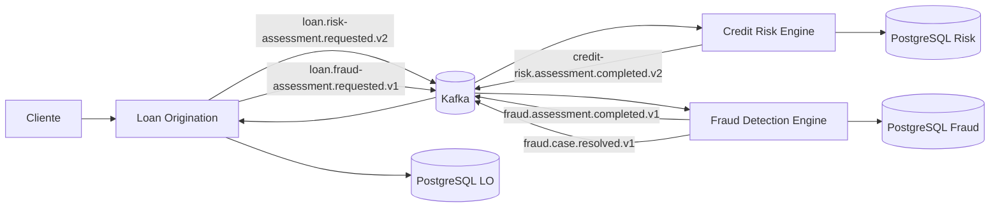
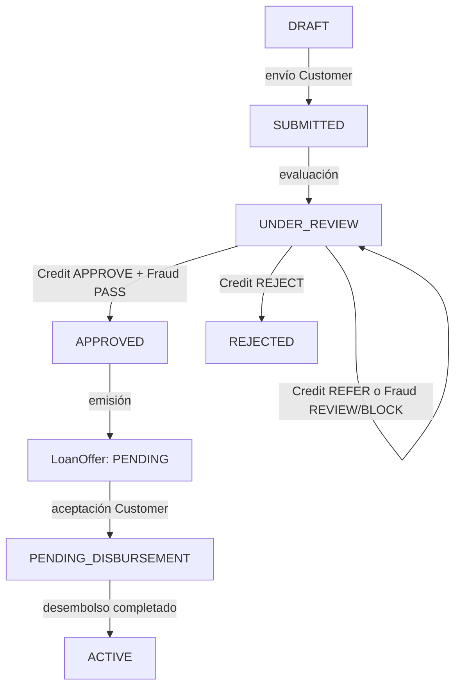
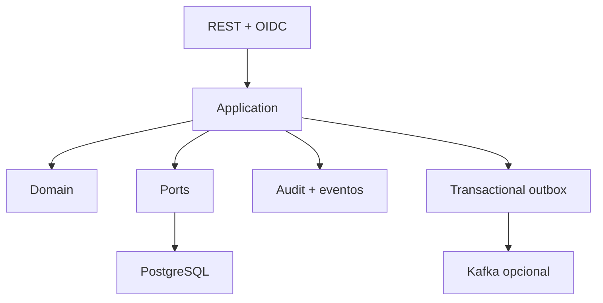

# Loan Origination Platform

Plataforma de demostración del proceso de originación: desde que una persona solicita crédito hasta que acepta una oferta, se desembolsa un préstamo y consulta cuotas. No es un core bancario completo ni mueve dinero real.

## Ecosistema

Loan Origination conserva el workflow y el estado financiero. Credit Risk evalúa elegibilidad y capacidad a partir de información declarada. Fraud Detection busca señales de comportamiento sospechoso y permite investigación humana. Son bounded contexts separados, con bases propias; Risk y Fraud no se llaman entre sí.



## Flujo y reglas



Application, Offer y Loan son conceptos distintos: APPROVED permite continuar a oferta, no crea deuda. Estados de solicitud: DRAFT (borrador), SUBMITTED (enviada), UNDER_REVIEW (evaluación/revisión), APPROVED (habilitada para oferta), REJECTED y CANCELLED. CUSTOMER crea/consulta/envía solicitudes; el backend aplica ownership. LOAN_OFFICER/ADMIN opera colas y decisiones permitidas.

Sólo Credit APPROVE + Fraud PASS permite aprobación automática. Credit REFER permanece UNDER_REVIEW; una decisión manual de crédito sólo puede aprobar si Fraud PASS. Credit REJECT lo aplica LO. Fraud REVIEW o BLOCK mantiene cerrado el gate y el oficial no puede ignorarlo. Una resolución Fraud CLEARED puede liberar el gate; CONFIRMED_FRAUD no. El assessment automático permanece inmutable.

### Oferta, préstamo y desembolso

LOAN_OFFICER/ADMIN emite una oferta sólo para solicitud APPROVED. El backend calcula cuota y total; el cliente puede consultar sus ofertas, aceptarlas o declinarlas. Estados: PENDING, ACCEPTED, DECLINED, EXPIRED. La oferta requiere principal/plazo compatibles con la solicitud y expiración futura. Aceptar requiere Idempotency-Key; locks y unicidad persistente protegen que una oferta cree como máximo un Loan.

Aceptar crea Loan PENDING_DISBURSEMENT; aún no significa que el dinero se entregó. El operador inicia desembolso local: PENDING, PROCESSING, COMPLETED, FAILED o CANCELLED. El adaptador de desarrollo devuelve referencia local. Al completar, el Loan queda ACTIVE y se fija el Repayment Schedule. Otros estados modelados: PAID_OFF, DEFAULTED, CANCELLED; no existe flujo de pagos.

### Amortización

El calendario usa sistema francés de cuota fija: M=P×[r(1+r)^n]/[(1+r)^n−1]. Tasa nominal anual porcentual se convierte a mensual dividiendo por 1200. Cálculo BigDecimal, precisión centralizada y redondeo monetario a centavos. El desembolso ancla fechas mensuales. Cada cuota muestra capital, interés, total y saldo; la última ajusta capital para cerrar exactamente en cero. Installment: PENDING, PAID, OVERDUE, CANCELLED. Sin pagos parciales ni collections.

## Arquitectura y fiabilidad

Java/Quarkus con arquitectura hexagonal por capability: domain protege invariantes, application orquesta, ports declaran dependencias y adapters conectan REST, OIDC, PostgreSQL, Kafka y desembolso local.



Estado, auditoría y outbox se guardan juntos; publisher entrega después del commit. Kafka es at-least-once, por lo que consumers deduplican. Idempotency-Key protege operaciones seleccionadas; invariantes también usan validación, locks y constraints. X-Correlation-ID conecta HTTP/audit/eventos y coexiste con trace/span IDs.

## Roles, consola y API

| Rol | Capacidades |
|---|---|
| CUSTOMER | Recursos propios; crear/enviar solicitudes, decidir sobre oferta, consultar préstamo/cuotas. |
| LOAN_OFFICER | Evaluación, revisión, oferta y desembolso sujeto a gates. |
| AUDITOR | Lectura autorizada y audit; sin mutaciones. |
| ADMIN | Operación y auditoría según permisos de endpoint. |

Keycloak Dev Services: realm loan-origination, cliente SPA loan-frontend. Usuarios dev: customer/customer (CUSTOMER), loan-officer/loan-officer (LOAN_OFFICER), auditor/auditor (AUDITOR), admin/admin (ADMIN). Customer bootstrap usa name/email; backend toma sub del JWT. El frontend no envía ese subject.

SPA: /login, /dashboard, /applications, /applications/:id, /offers, /offers/:id, /loans, /loans/:id, /customers/:id, /audit.

API bajo /api/v1; /api requiere autenticación.

| Método y ruta | Rol/uso |
|---|---|
| POST /api/v1/customers; GET /api/v1/customers/me | CUSTOMER: alta/perfil propio |
| GET /api/v1/loan-applications/mine; POST /api/v1/loan-applications | CUSTOMER |
| POST /api/v1/loan-applications/{id}/submit | CUSTOMER |
| GET /api/v1/loan-applications?status=… | LOAN_OFFICER, ADMIN |
| POST /api/v1/loan-applications/{id}/evaluate, /approve, /reject | LOAN_OFFICER, ADMIN |
| POST /api/v1/loan-offers/from-application/{id} | LOAN_OFFICER, ADMIN |
| GET /api/v1/loan-offers/mine; POST /api/v1/loan-offers/{id}/accept o /decline | CUSTOMER |
| GET /api/v1/loans/mine; GET /api/v1/loans/{id}/repayment-schedule o /installments | CUSTOMER con ownership |
| GET/POST /api/v1/loans/{id}/disbursement | consultar/iniciar según rol |
| GET /api/v1/audit/events[/{aggregateId}] | AUDITOR, ADMIN |

Idempotency-Key se exige en creación/envío, decisiones manuales, aceptación y desembolso según endpoint. OpenAPI /q/openapi; Swagger dev /q/swagger-ui.

## Kafka

| Topic | Productor → consumidor | Propósito |
|---|---|---|
| loan.risk-assessment.requested.v2 | LO → Credit Risk | Solicitar evaluación |
| credit-risk.assessment.completed.v2 | Credit Risk → LO | Decisión de riesgo |
| loan.fraud-assessment.requested.v1 | LO → Fraud | Solicitar evaluación |
| fraud.assessment.completed.v1 | Fraud → LO | Resultado/señales |
| fraud.case.resolved.v1 | Fraud → LO | Resolución humana |

Modo LOCAL y canales Kafka apagados por defecto. Integración requiere habilitar channels y compartir broker. Outbox, versionado, DLQ y deduplicación mitigan pérdida, incompatibilidad y repetición; no todos los eventos internos se publican.

## Desarrollo y operación

Java 25, Quarkus 3.39.5, PostgreSQL, Hibernate/Panache, Flyway, OIDC/Keycloak, Kafka opcional, React, TypeScript, Vite y Bun. Compose publica PostgreSQL 5432; default app apunta a 5433, fija URL explícita para Compose.

```powershell
docker compose up -d postgres
$env:DB_JDBC_URL='jdbc:postgresql://localhost:5432/loan_origination'
.\mvnw.cmd quarkus:dev
```

API 8080, Keycloak 8180. Otra terminal: cd frontend; bun install; bun run dev. Portal http://localhost:5173. Configuración SPA: frontend/.env.example. Variables backend: PORT, DB_USERNAME, DB_PASSWORD, DB_JDBC_URL, OIDC_AUTH_SERVER_URL, FRONTEND_ORIGIN, KAFKA_BOOTSTRAP_SERVERS y toggles RISK_/FRAUD_. No poner secretos en VITE_* ni usar Dev Services en prod.

Flyway aplica migraciones V1–V14 al inicio; Hibernate valida. El schema vive en src/main/resources/db/migration. No usar update/drop-and-create ni borrar volúmenes con datos. Kafka local puede reutilizar Credit Risk en 29092; este compose sólo inicia PostgreSQL. Para el flujo completo se configuran RISK_ASSESSMENT_MODE=KAFKA, RISK_KAFKA_ENABLED=true, FRAUD_ASSESSMENT_MODE=KAFKA y FRAUD_KAFKA_ENABLED=true, además del bootstrap compartido. Health /q/health/live y /q/health/ready; métricas /q/metrics; OpenAPI /q/openapi. OTLP opcional; logs JSON en prod.

```powershell
.\mvnw.cmd test
.\mvnw.cmd verify
.\mvnw.cmd package
cd frontend
bun install
bun run build
```

## Alcance y competencias

Demuestra gates, ownership/RBAC, oferta vs deuda, desembolso, amortización, audit, outbox, idempotencia, concurrencia y observabilidad. No implementa transferencia bancaria, bureau, KYC/AML completo, pagos parciales ni collections. Desembolso local.

Competencias: modelado de dominio, Java/Quarkus y Hexagonal, BigDecimal/sistema francés, PostgreSQL/Flyway/constraints, Kafka/outbox/at-least-once, OIDC/Keycloak/RBAC, React/TypeScript, health/métricas/OTel, Docker y CI.

| Proyecto | Dominio | Arquitectura | Responsabilidad | Integración |
|---|---|---|---|---|
| Loan Origination Platform | Lending | Hexagonal | Solicitud a préstamo activo | Kafka |
| Credit Risk Engine | Riesgo crediticio | Clean | Capacidad y elegibilidad | Kafka |
| Fraud Detection Engine | Fraude | Modular por capas | Señales e investigación | Kafka |

Licencia: MIT, ver LICENSE.
