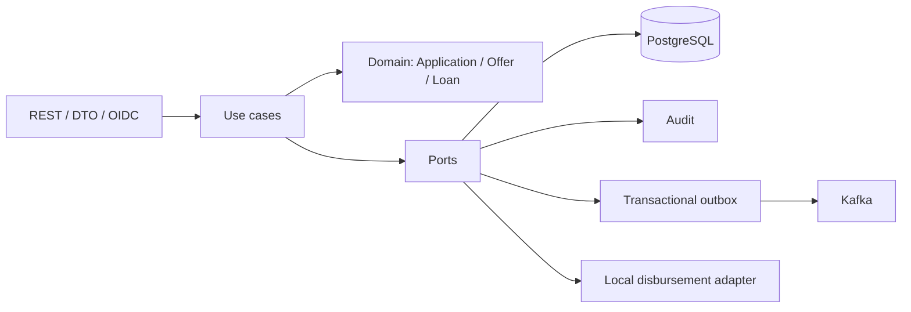

# Backend: de una solicitud a un préstamo activo

## Separación de conceptos

| Concepto | Responsabilidad | Momento financiero |
|---|---|---|
| Customer | Vínculo entre perfil y subject autenticado | No es una cuenta bancaria |
| LoanApplication | Necesidad de financiación, datos declarados y workflow | APPROVED permite una oferta |
| Risk/Fraud assessment | Resultado externo o local, con referencia y versión | No crea deuda |
| LoanOffer | Condiciones comerciales con vencimiento | PENDING no equivale a préstamo |
| Loan | Snapshot aceptado por el cliente | Nace PENDING_DISBURSEMENT |
| Disbursement | Operación de entrega por un adaptador | COMPLETED habilita ACTIVE |
| Repayment Schedule | Capital, interés, fechas y saldo por cuota | Calendario; no motor de cobranzas |

## Arquitectura hexagonal por capability

Las capacidades se organizan alrededor de dominio, servicios de aplicación, puertos y adaptadores. REST convierte DTOs y aplica autenticación; application orquesta transacciones; el dominio protege estados y valores; los puertos permiten cambiar persistencia, mensajería o desembolso sin convertir el dominio en un controller.



Domain no delega su autoridad al frontend. CUSTOMER resuelve su identidad desde el JWT; consultar o aceptar requiere ownership. El cliente no selecciona arbitrariamente el subject de otra persona mediante un body.

## Gates de crédito y fraude

El modo LOCAL usa implementaciones locales; no demuestra una llamada real a los otros motores. En modo KAFKA, Loan Origination solicita resultados y conserva la autoridad de transicionar la solicitud.

| Riesgo | Fraude | Consecuencia |
|---|---|---|
| APPROVE | PASS | Puede aprobar automáticamente |
| APPROVE | REVIEW/BLOCK sin disposición válida | Permanece en revisión |
| REFER | Gate de fraude liberado | Puede requerir decisión manual autorizada |
| REJECT | Cualquiera | Rechazo crediticio aplicado por LO |
| APPROVE | Caso CLEARED | La resolución humana puede liberar el gate y habilitar aprobación |
| Cualquiera | CONFIRMED_FRAUD | No libera el gate |

La disposición CLEARED es un dato separado; no cambia el assessment automático a PASS. El gate externo es requerido cuando el modo de fraude es KAFKA. Un oficial no puede ignorar ese gate por enviar un POST manual.

El servicio de finalización de riesgo bloquea la solicitud dentro de la transacción, valida las referencias del resultado y deduplica assessments. Un resultado tardío puede guardarse para trazabilidad sin modificar una solicitud que ya no esté UNDER_REVIEW.

## Aceptación, locks e idempotencia

[AcceptLoanOfferService](../src/main/java/com/loanorigination/loanoffer/application/service/AcceptLoanOfferService.java) obtiene la oferta con bloqueo, resuelve al cliente autenticado y valida ownership. Una oferta vencida no se acepta. Una aceptación ya completada puede devolver el préstamo existente; la unicidad persistente evita dos préstamos para la misma oferta.

[IdempotencyService](../src/main/java/com/loanorigination/idempotency/application/service/IdempotencyService.java) vincula clave, actor, operación y hash de la petición. Repetir la misma entrada recupera la respuesta; reutilizar la clave con otro contenido o encontrar una operación en curso produce conflicto. Las operaciones externas tienen fases de claim/finalización en transacciones independientes. No todas las requests REST son idempotentes por el mero hecho de enviar un header.

## Desembolso y calendario

[FinalizeDisbursementService](../src/main/java/com/loanorigination/disbursement/application/service/FinalizeDisbursementService.java) bloquea préstamo y desembolso. Requiere PROCESSING y Loan PENDING_DISBURSEMENT. Un desembolso COMPLETED no vuelve a generar cuotas. Si el adaptador falla se registra FAILED; cuando tiene éxito, calendario, desembolso, activación y eventos se persisten de forma consistente.

El adaptador local no hace una transferencia bancaria real. ACTIVE en las capturas significa que ese flujo local ya finalizó en la base de desarrollo.

La amortización usa BigDecimal y sistema francés. Con tasa mensual r, capital P y n cuotas:

```text
M = P × r × (1+r)^n / ((1+r)^n - 1)
r = TNA porcentual / 1200
```

La última cuota ajusta centavos para cerrar el capital exactamente. Fixture visual: P=100.000 ARS, TNA=36%, n=24; cuota regular 5.904,74 y final 5.904,80. El calendario no demuestra pago de cuotas, mora real ni cobranzas.

## Auditoría, outbox y observabilidad

Audit registra actor, evento, agregado, timestamp y correlación. La consola AUDITOR consulta registros; no opera ofertas o desembolsos. Correlation ID une HTTP, audit y eventos; trace/span IDs cubren el tracing técnico.

[OutboxPublishingService](../src/main/java/com/loanorigination/outbox/application/service/OutboxPublishingService.java) publica después del commit, con claim y lease para el lote. La persistencia del evento y el estado de negocio no dependen de un publish síncrono exitoso. La entrega sigue siendo at-least-once: consumers y constraints deben tolerar repetición.

Flyway versiona V1–V14; Hibernate valida el schema. Health, métricas y OpenAPI están en /q. Los detalles de despliegue y endurecimiento están en [production-readiness.md](production-readiness.md).

## Cobertura y límites

El repositorio contiene tests de gate, atomicidad de workflow, idempotencia y concurrencia de aceptación. Esta campaña de documentación ejecutó los unitarios indicados en [evidencia](evidence-2026-10-10.md); no volvió a ejecutar una aceptación/desembolso ni el ecosistema Kafka completo.

No hay core bancario, transferencia productiva, cálculo bureau/FICO, KYC/AML completo ni motor de cobranza. PAID_OFF y DEFAULTED están modelados; no se presenta una UI de repago como funcionalidad terminada.
