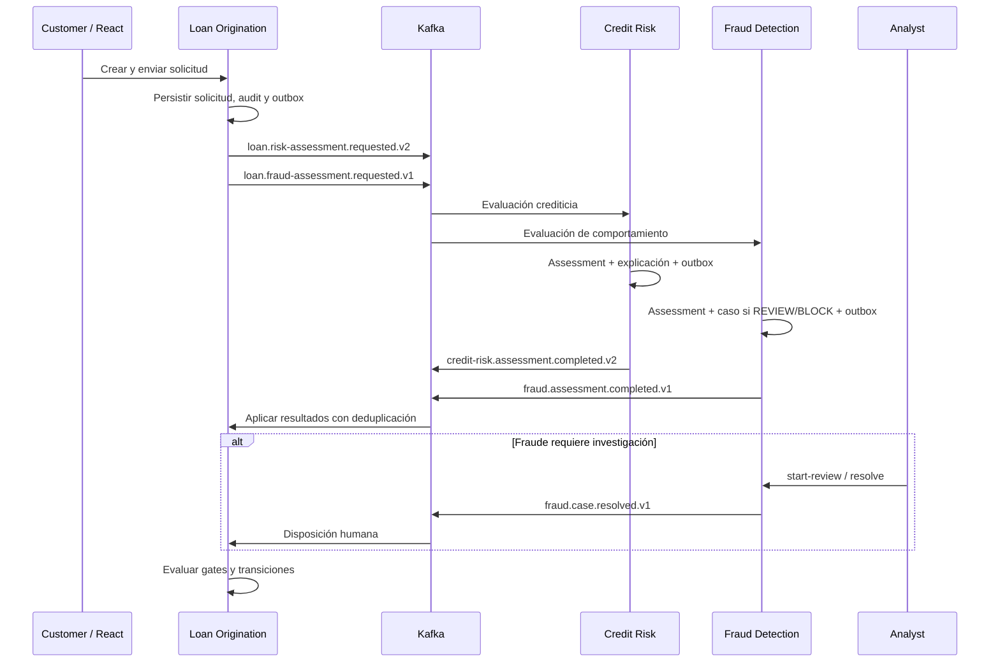

# Ecosistema y flujo de integración

## Tres autoridades, tres bases

| Proyecto | Decide y conserva | No debe hacer |
|---|---|---|
| [Loan Origination](https://github.com/youngnicoJava/loan-approval-engine) | Solicitud, oferta, aceptación, préstamo, desembolso, cuotas y audit | Confundir un score externo con deuda creada |
| [Credit Risk](https://github.com/youngnicoJava/credit-risk-engine) | Elegibilidad/capacidad, score, banda y explicación versionada | Emitir ofertas o escribir en PostgreSQL LO |
| [Fraud Detection](https://github.com/youngnicoJava/fraud-detection-engine) | Señales, assessment, casos y disposición humana | Aprobar crédito o transferir fondos |

Las consolas React llaman a su propia API autenticada. Credit Risk y Fraud no se llaman entre sí; Loan Origination compone sus resultados. Las bases y los realms de desarrollo son independientes.

## Flujo Kafka implementado

Los resultados pueden llegar en distinto orden. UNDER_REVIEW no significa que el frontend deba aprobar al recibir el primero. LO preserva las condiciones de crédito y fraude; una disposición CLEARED puede liberar el gate sin reescribir el assessment original.

## Contratos activos

| Topic | Emite | Consume | Propósito |
|---|---|---|---|
| loan.risk-assessment.requested.v2 | LO | Credit Risk | Perfil financiero declarado y referencias |
| credit-risk.assessment.completed.v2 | Credit Risk | LO | Resultado crediticio explicable |
| loan.fraud-assessment.requested.v1 | LO | Fraud | Entrada y referencias para señales |
| fraud.assessment.completed.v1 | Fraud | LO | PASS/REVIEW/BLOCK, score, señales |
| fraud.case.resolved.v1 | Fraud | LO | CLEARED/CONFIRMED_FRAUD |

Event ID, versión, correlación y referencias de assessment/application permiten validación y deduplicación. Correlation ID no sustituye assessmentRequestId ni constituye una autorización. Las DLQ de los consumers de entrada permiten separar mensajes incompatibles o no procesables de decisiones negativas de negocio.

## Outbox y repetición

La transacción guarda estado y evento pendiente; el publisher envía después. Si enviar o confirmar la publicación falla, puede haber repetición. Por eso la garantía es at-least-once, no exactly-once. Replay de la misma entrada material debe recuperar el resultado; reutilizar la referencia con contenido distinto debe conflictúar.

Kafka no sustituye una transacción entre tablas de una misma base y tampoco proporciona una transacción distribuida entre las tres bases. Los consumidores aplican límites transaccionales locales, locks e invariantes.

## LOCAL frente a KAFKA

LO tiene modos locales de evaluación y toggles para mensajería. En LOCAL, sus reglas no equivalen a personal-loan-ar 2.0.0 y no se demuestra comunicación con los motores externos. En integración, hay que compartir broker y habilitar los canales correspondientes en cada aplicación.

Para LO: RISK_ASSESSMENT_MODE=KAFKA, RISK_KAFKA_ENABLED=true, FRAUD_ASSESSMENT_MODE=KAFKA, FRAUD_KAFKA_ENABLED=true. Credit Risk y Fraud requieren sus toggles de canales y KAFKA_BOOTSTRAP_SERVERS. Un broker levantado no prueba que los consumers estén habilitados.

La sesión de capturas mantuvo Kafka deshabilitado y schedulers apagados para consultar fixtures históricos sin provocar nuevas operaciones de background. El diagrama describe el código implementado; **no es un certificado de E2E Kafka ejecutado el 10/10/2026**.

## Flujo financiero posterior

APPROVED → oferta PENDING → aceptación del cliente → Loan PENDING_DISBURSEMENT → operación de desembolso local COMPLETED → Loan ACTIVE + calendario. La evaluación crediticia no es una oferta; la oferta no es una transferencia; el calendario no demuestra cobro de cuotas.

## Identidad y operación

Cada SPA usa OIDC/PKCE y un cliente público. Bearer tokens y roles se validan en la API; ocultar un botón no protege un endpoint. No deben existir passwords o client secrets en VITE_*. Los usuarios importados por Dev Services son exclusivamente de desarrollo.

Para revisar contratos específicos, usar el README y los documentos Kafka de cada repositorio. Health/readiness, OpenAPI, métricas y tracing facilitan diagnóstico; su existencia no implica infraestructura de observabilidad productiva ya desplegada.
