# Recorrido visual de Loan Origination Platform

[Índice](README.md) · [Backend](backend-walkthrough.md) · [Evidencia](evidence-2026-10-10.md)

Capturas reales del 10/10/2026. Cada pantalla está conectada a la API y PostgreSQL locales. Los registros eran preexistentes; los formularios y acciones de operación se muestran sin ejecutarlos. Las vistas de autenticación no contienen contraseñas ni tokens.

## 1. El portal del cliente

**Rol:** CUSTOMER · **Ruta:** /dashboard

Dos solicitudes propias y un préstamo activo. Las acciones del cliente y las de operaciones se presentan en vistas diferentes.

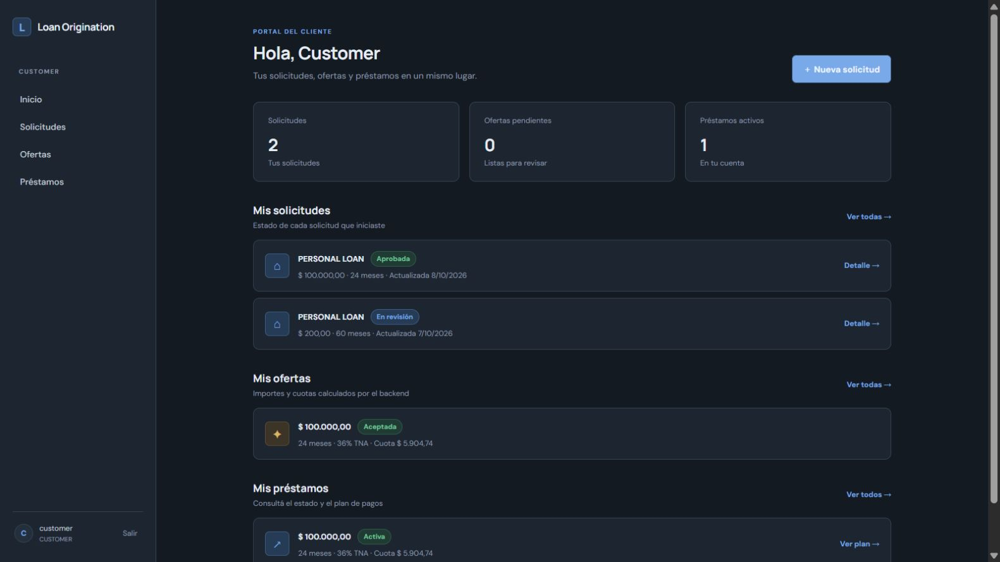

## 2. Acceso al portal

**Rol:** PUBLIC · **Ruta:** /login

Pantalla real anterior al inicio de sesión.

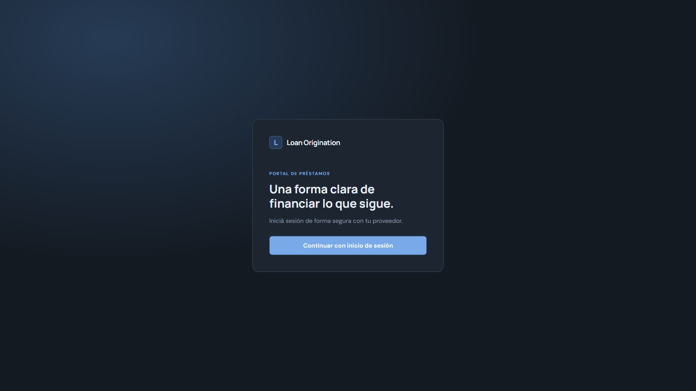

## 3. Autenticación delegada

**Rol:** PUBLIC · **Ruta:** /realms/loan-origination/protocol/openid-connect/auth

Formulario real de Keycloak, capturado sin contraseña ni token. La SPA usa OIDC y PKCE; el backend valida el bearer token.

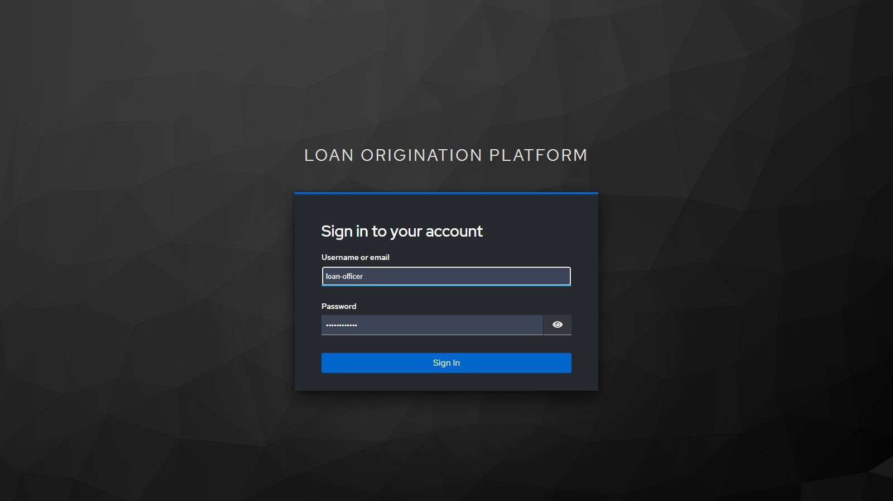

## 4. Solicitud y perfil declarado

**Rol:** CUSTOMER · **Ruta:** /applications

Formulario real de creación con importe, plazo y datos financieros. No se envió una nueva solicitud durante la captura.

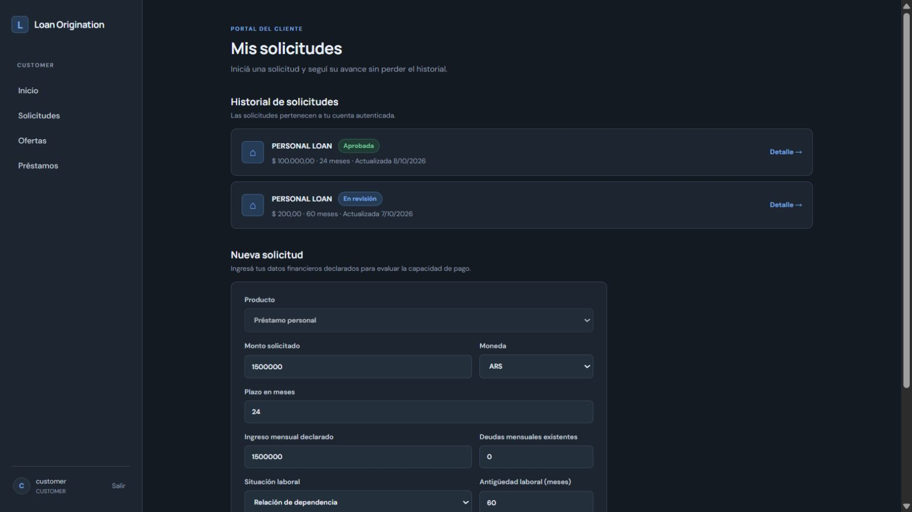

## 5. Solicitud aprobada

**Rol:** CUSTOMER · **Ruta:** /applications/81dd9a3c-4b32-4148-a3c3-8f49292f0639

Solicitud existente de ARS 100.000 a 24 meses. APPROVED habilita una oferta; no representa por sí mismo una deuda.

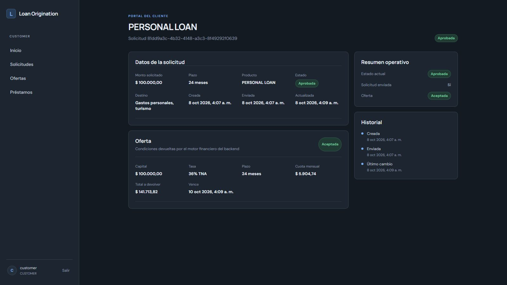

## 6. Cola de operaciones

**Rol:** LOAN_OFFICER · **Ruta:** /dashboard

Indicadores y solicitudes para el oficial. Los registros existentes muestran decisiones y desembolsos pendientes; no se ejecutaron las acciones.

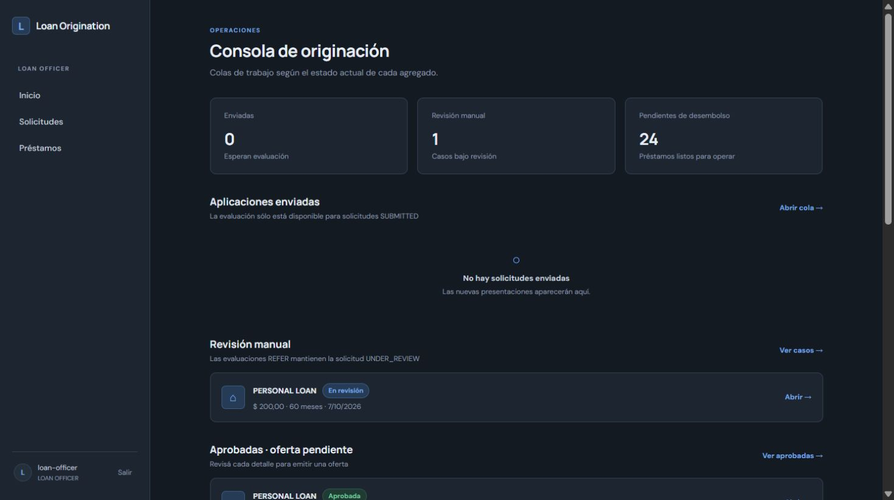

## 7. Evaluación y decisión manual

**Rol:** LOAN_OFFICER · **Ruta:** /applications/e1914cf3-01a9-4d60-9cb1-74577151498f

Resultado REFER de LOCAL_RULES y acciones del oficial. Este fixture de ARS 200 no es una evaluación de Credit Risk personal-loan-ar 2.0.0: son políticas diferentes.

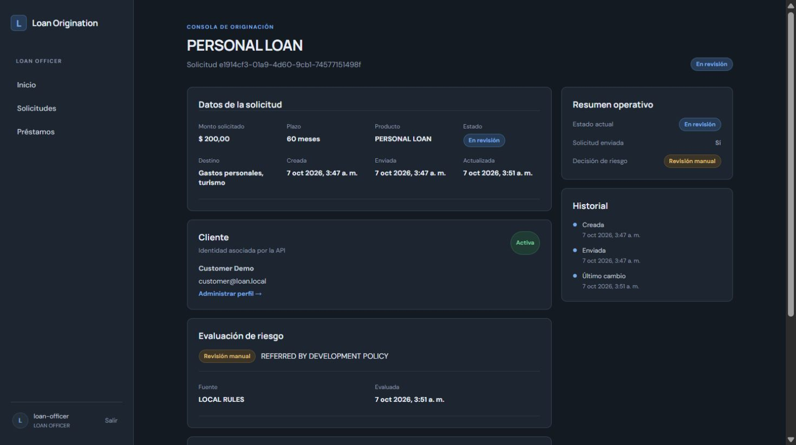

## 8. Condiciones de una oferta pendiente

**Rol:** LOAN_OFFICER · **Ruta:** /applications/0851ce77-0857-4d1b-935c-6084411f71d7

Oferta histórica de ARS 1.500.000, 24 meses y 55% TNA. La expiración y las condiciones pertenecen a la oferta. No fue aceptada durante esta sesión.

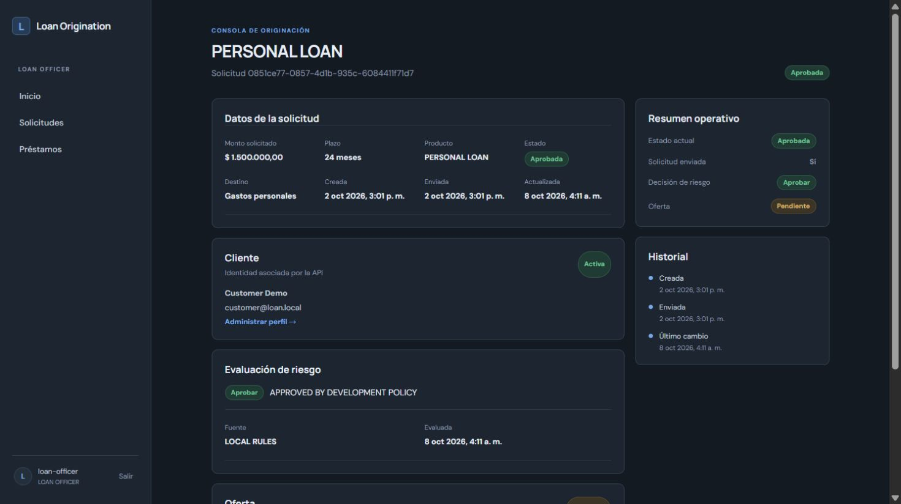

## 9. Ofertas del cliente

**Rol:** CUSTOMER · **Ruta:** /offers

Oferta aceptada de ARS 100.000. El listado no combina las ofertas con el préstamo desembolsado.

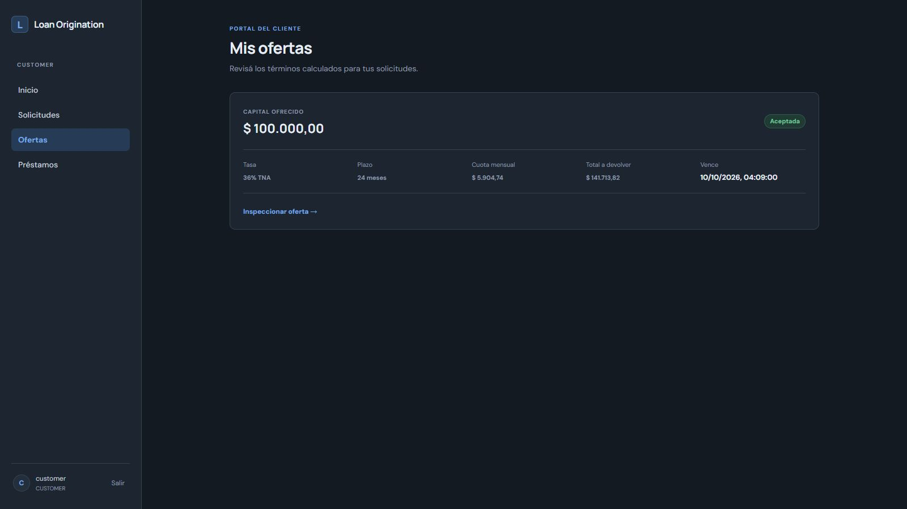

## 10. Snapshot comercial aceptado

**Rol:** CUSTOMER · **Ruta:** /offers/44dacdae-bb3c-458b-9549-21b905cd5291

Importe, tasa, plazo, cuota y total. Algunas vistas antiguas redondean la presentación; el calendario financiero usa importes monetarios a centavos.

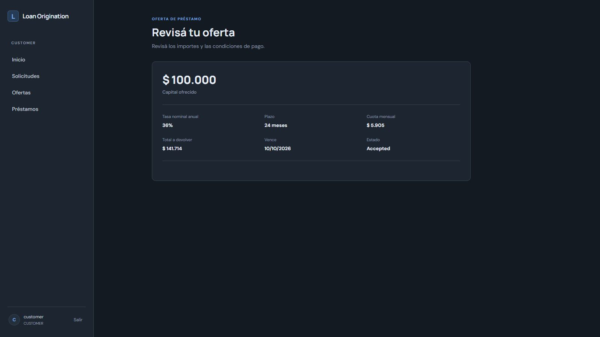

## 11. Préstamos propios

**Rol:** CUSTOMER · **Ruta:** /loans

Listado del préstamo ACTIVE, consultado con ownership.

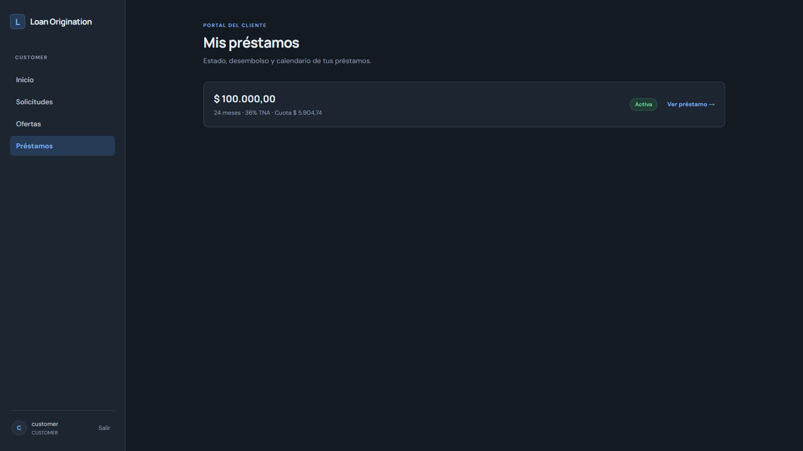

## 12. Desembolso como operación separada

**Rol:** LOAN_OFFICER · **Ruta:** /loans/43a4e896-bfe8-48e5-bfb9-fd761912f815

Fixture de ARS 10.000 en PENDING_DISBURSEMENT. La acción visible no fue ejecutada. El adaptador local no transfiere dinero bancario real.

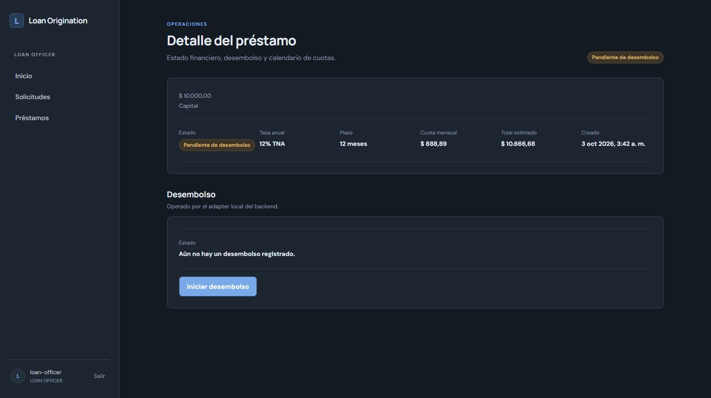

## 13. Préstamo activo y desembolso

**Rol:** CUSTOMER · **Ruta:** /loans/39e78666-f288-42e4-84e5-5bcb631f2a56

Préstamo histórico ACTIVE: ARS 100.000, 36% TNA, 24 meses. Desembolso local COMPLETED y calendario persistido.

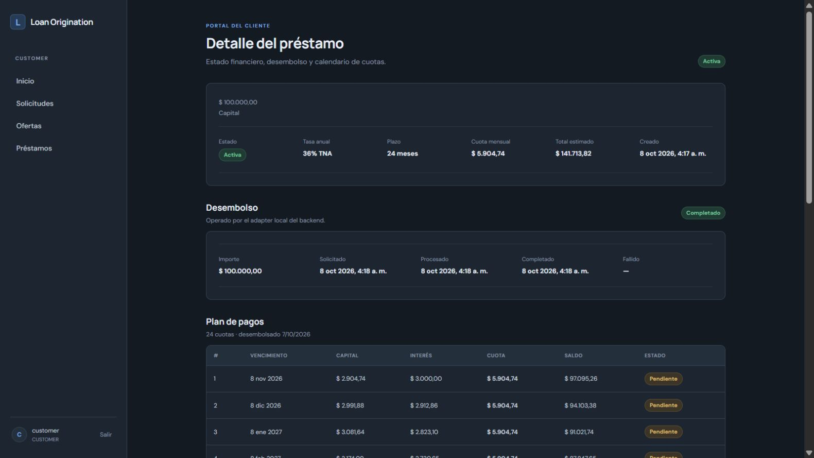

## 14. Amortización y cierre del saldo

**Rol:** CUSTOMER · **Ruta:** /loans/39e78666-f288-42e4-84e5-5bcb631f2a56

Últimas cuotas del sistema francés. Cuota regular ARS 5.904,74; última ARS 5.904,80 por ajuste de centavos. Saldo final ARS 0,00. No hay cobros de cuotas ejecutados.

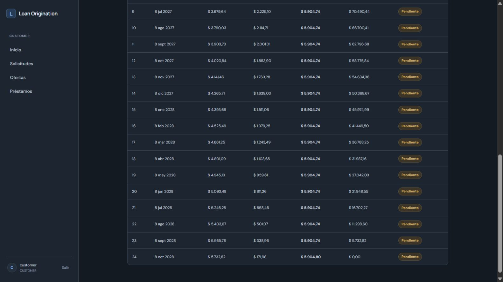

## 15. Vista del auditor

**Rol:** AUDITOR · **Ruta:** /dashboard

Eventos existentes, sin acciones de aprobación o desembolso.

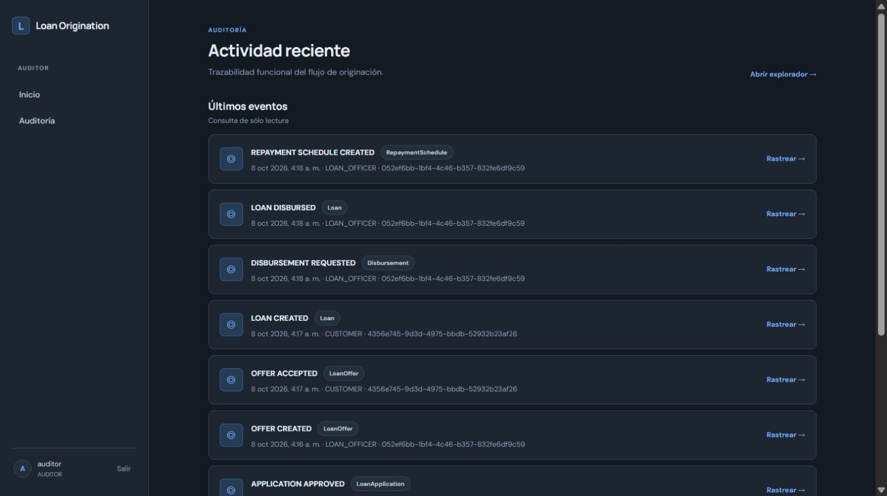

## 16. Auditoría consultable

**Rol:** AUDITOR · **Ruta:** /audit

Historial con evento, agregado, actor y correlación. Es evidencia de registros persistidos, no una ejecución nueva del flujo completo.

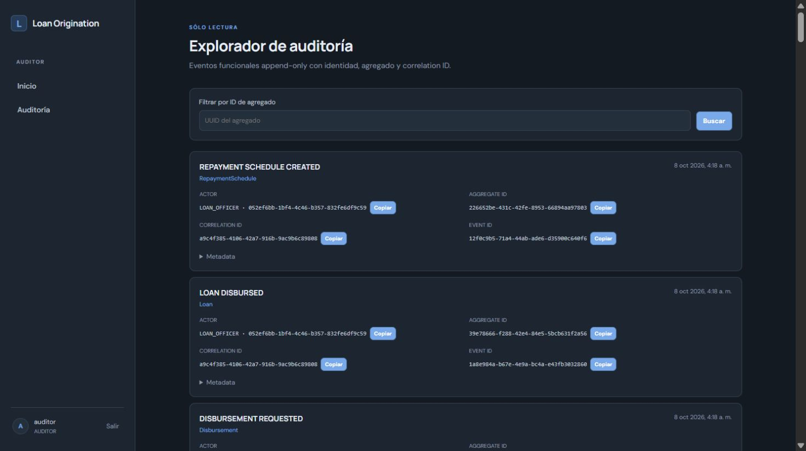

## 17. Contrato REST generado

**Rol:** PUBLIC · **Ruta:** /q/swagger-ui

Swagger real servido por Quarkus en desarrollo. Los ejemplos de Swagger son plantillas; no son respuestas de operaciones ejecutadas.

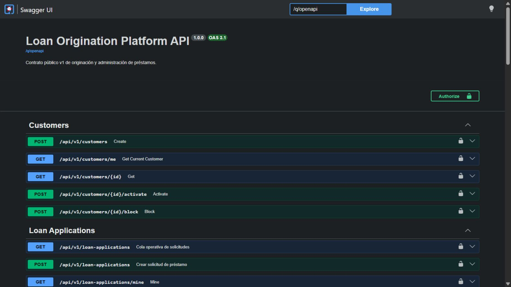

## Cómo interpretar esta galería

Los IDs visibles corresponden a fixtures de desarrollo. No se afirma que todas las pantallas pertenezcan a la misma solicitud ni que el flujo haya sido ejecutado de cero en esta sesión. Swagger muestra el contrato generado; sus ejemplos son plantillas. Para pruebas ejecutadas, consultar la evidencia.
